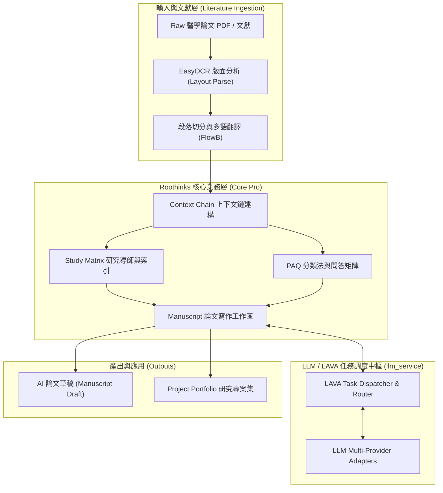

<div align="center">

# 🔬 Roothinks
### **AI Research & Medical Literature Workflow Processing System**

[](https://www.python.org/)
[](https://fastapi.tiangolo.com/)
[](https://pytorch.org/)
[](https://github.com/JaidedAI/EasyOCR)
[](https://www.docker.com/)

*專為醫學文獻解析、FlowB 論文處理流水線、PAQ 數據矩陣與論文寫作打造的 AI 智能工作引擎*

[✨ 核心亮點](#-核心亮點-key-highlights) •
[🏛️ 系統架構](#-系統架構圖-architecture) •
[🧩 核心模組](#-核心系統模組-module-breakdown) •
[🚀 快速開始](#-快速開始指南-quick-start) •
[📑 生產過渡規劃](#-生產過渡與規範)

</div>

---

## 📖 專案簡介 (Project Overview)

**Roothinks** 是一套先進的本地化 AI 科研與文獻工作流系統。專為醫學研究團隊、臨床論文作者與學術分析人員設計。系統整合 **FlowB 文獻處理流水線**、**EasyOCR 版面分析**、**PAQ (Precision Question) 分類矩陣**，以及 **Manuscript 論文寫作工作區**，實現從 Raw PDF 論文解析到 AI 輔助論文撰寫的完整閉環。

> 💡 **資料邊界與隱私安全**：倉庫源碼預設排除所有本地運行數據、模型權重檔 (`.pth`)、上傳論文與敏感密鑰 (`.env`)，確保團隊協同與合規安全。

---

## ✨ 核心亮點 (Key Highlights)

| 特性模組 | 功能描述 | 核心技術與優勢 |
| :--- | :--- | :--- |
| 📄 **FlowB 文獻處理流水線** | 醫學論文 PDF 智慧解析與結構化 | 整合 EasyOCR 版面分析 (Layout Parsing)、段落切分、多語翻譯與 Context Chain |
| ✍️ **Manuscript 論文寫作工作區** | AI 輔助論文草稿撰寫與修訂 | 支援段落上下文注入、實證資料引用對齊、圖表整合與寫作規範輔助 |
| ❓ **PAQ 醫患問題矩陣** | 精準問答 (Precision QA) 互動中樞 | 構建 PAQ 分類法 (Taxonomy) 與知識矩陣，實現高精度臨床問答對接 |
| 🎓 **Study Matrix 研究導師** | 研究數據載入與矩陣分析 | 提供自動化 Study Index 構建、AI Study Tutor 與文獻數據分析 |
| 🤖 **LLM / LAVA 引擎調度** | 多大語言模型適配與任務派發 | 統一 LLM Provider Adapter，支援多模型並發調度與狀態監控 |

---

## 🏛️ 系統架構圖 (Architecture)



---

## 🧩 核心系統模組 (Module Breakdown)

```
roothinks/
├── app/
│   ├── core_pro/
│   │   ├── literature/        # 📄 FlowB 文獻處理、OCR/Layout 解析與 Context Chain
│   │   ├── study/             # 🎓 Study Index、資料載入器、研究矩陣與 AI Tutor
│   │   ├── paq/               # ❓ PAQ 分類法 (Taxonomy)、矩陣與互動邏輯
│   │   └── manuscript/        # ✍️ 論文工作區、段落模型、圖片處理與草稿撰寫
│   ├── llm_service/           # 🤖 LLM 多模型 Adapter、Task Dispatcher 與路由
│   └── project_portfolio/     # 📂 專案組合 (Portfolio) 服務層與路由
├── debugging/                 # 🐞 FlowB 監控與故障排除工具
├── evaluation/                # 🧪 評測數據與效能校驗腳本
├── docs/                      # 📑 系統設計與轉產文件 (PROD_TRANSITION_PLAN.md)
├── scripts/                   # 🛠️ 數據處理與輔助自動化腳本
└── docker-compose.yml         # 🐳 Docker 多容器部署配置
```

---

## 🚀 快速開始指南 (Quick Start)

### 1. 複製倉庫 (Clone Repository)
```bash
git clone https://github.com/LAVA-Cowork/roothinks.git
cd roothinks
```

### 2. 環境配置 (Environment Setup)
複製環境變數範本並設定本地參數：
```bash
cp .env.example .env
```

### 3. 安裝依賴與啟動服務 (Install & Run)
```bash
python -m venv .venv
# Windows:
.venv\Scripts\activate
# Linux/macOS:
source .venv/bin/activate

pip install -r requirements.txt
python main.py
```

### 4. Docker 部署 (Docker Compose)
```bash
docker-compose up -d --build
```

---

## 📑 生產過渡與規範 (Production Guidance)

- **預檢與調試**：執行 `python deploy_preflight.py` 進行部署前環境與依賴預檢。
- **數據版面規範**：參閱 `DATA_LAYOUT_POLICY.md` 了解原始論文與快取資料的目錄保護政策。
- **上線升級規劃**：參閱 `PROD_TRANSITION_PLAN.md` 了解生產環境過渡與資料庫遷移指南。

---

<div align="center">

Made with ❤️ by **LAVA-Cowork Team**

</div>
