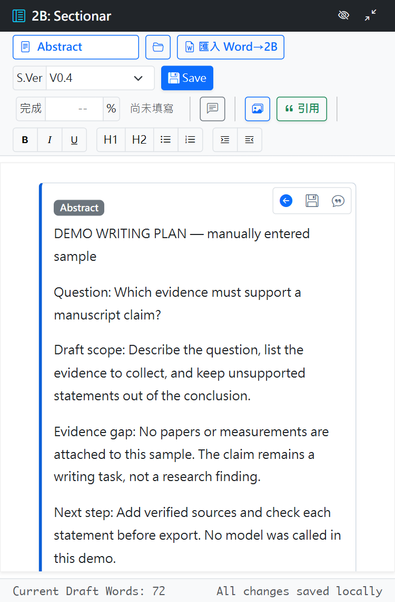
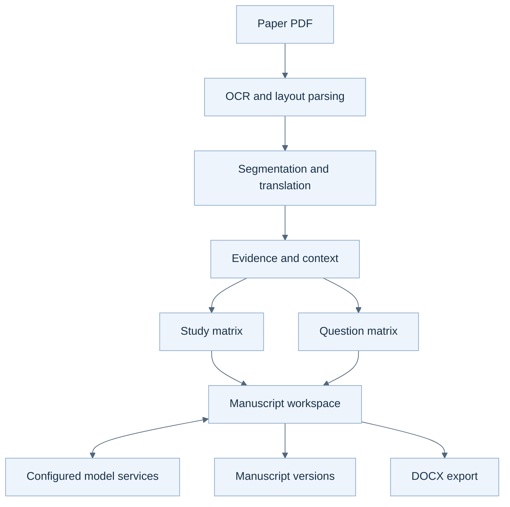

# Roothinks

A workspace for reading papers, organizing evidence, and editing manuscripts.

Read a paper in the literature workspace, organize its evidence in study notes
and question matrices, then edit manuscript sections. Keep the research question
and evidence gaps visible as you write; review each claim before export.

**Prototype.** Manual section editing can be inspected locally. Paper processing
and model-backed actions require configuration and separate checks; the full
paper-to-manuscript path and current deployment were not verified in this batch.

[Start locally](#start-locally) · [See the workflow](#workflow) · [Data layout](DATA_LAYOUT_POLICY.md)



*Real UI, manually entered sample writing plan. Saved and reloaded in an isolated
local instance. No paper was processed and no model was called. Original UI
labels are unchanged.*

The sample records a question, a draft scope, an evidence gap and the next
check. It demonstrates manual editing and saved content, not evidence extracted
from a paper. See [what was checked](#verification-scope) for the export boundary.

## Start locally

Use Python 3.10+ in a fresh environment. The app is Flask with Socket.IO.
The dependency set includes OCR and translation libraries; installing it can
download large packages. Configure models separately before processing papers.

```powershell
git clone https://github.com/SpadesZ/roothinks-1.0.1.git
cd roothinks-1.0.1
Copy-Item .env.example .env
python -m venv .venv
.\.venv\Scripts\python -m pip install -r requirements.txt
$env:APP_ENV = "development"
$env:FLASK_DEBUG = "true"
$env:ALLOW_UNSAFE_WERKZEUG = "true"
$env:AUTH_MODE = "none"
$env:SOCKETIO_ASYNC_MODE = "threading"
.\.venv\Scripts\python main.py
```

Open http://127.0.0.1:10000. This mode is for a single-user local preview.
Create a sample project and open Manuscript to inspect the editor. Configure
model access through LAVA Setup when you need model-backed actions.

For container setup, use the existing Compose files and
[production transition guide](PROD_TRANSITION_PLAN.md). The current Dockerfile
also downloads and packages an NLLB model; the full image build was not rerun
for this review.

---

## Verification scope

On 2026-10-02, a manual sample was saved and reloaded in an isolated Flask
instance. The actual DOCX export endpoint returned a valid `.docx`; its ZIP
structure, document XML and sample text were checked. The 49 focused export
and export-route tests passed, including access limits.

The sample contains a writing question and an explicit evidence gap. It is not
a processed paper or research result. Checks used existing dependencies and
images; fresh installation, model calls and cloud deployment were not tested.

## 技術細節與原始操作文件（繁體中文）

<details>
<summary>原始專案介紹與技術連結</summary>

<div align="center">

# 🔬 Roothinks
### **AI Research & Medical Literature Workflow Processing System**

[](https://www.python.org/)
[](https://flask.palletsprojects.com/)
[](https://pytorch.org/)
[](https://github.com/JaidedAI/EasyOCR)
[](https://www.docker.com/)

*專為醫學文獻解析、FlowB 論文處理流水線、PAQ 數據矩陣與論文寫作打造的 AI 智能工作引擎*

[✨ 核心亮點](#-核心亮點-key-highlights) •
[🏛️ 系統架構](#workflow) •
[🧩 核心模組](#-核心系統模組-module-breakdown) •
[🚀 快速開始](#-快速開始指南-quick-start) •
[📑 生產過渡規劃](#production-guidance)

</div>

</details>

---

## 📖 專案簡介 (Project Overview)

**Roothinks** 是一套先進的本地化 AI 科研與文獻工作流系統。專為醫學研究團隊、臨床論文作者與學術分析人員設計。系統整合 **FlowB 文獻處理流水線**、**EasyOCR 版面分析**、**PAQ (Precision Question) 分類矩陣**，以及 **Manuscript 論文寫作工作區**，串接 PDF 解析、文獻整理與手稿編輯；各流程仍需依設定與資料實際驗證。

> 💡 **資料邊界與隱私安全**：倉庫源碼預設排除所有本地運行數據、模型權重檔 (`.pth`)、上傳論文與敏感密鑰 (`.env`)，用於保護本機資料；排除檔案不等於已完成合規或安全驗收。

---

## ✨ 核心亮點 (Key Highlights)

| 特性模組 | 功能描述 | 核心技術與優勢 |
| :--- | :--- | :--- |
| 📄 **FlowB 文獻處理流水線** | 醫學論文 PDF 智慧解析與結構化 | 整合 EasyOCR 版面分析 (Layout Parsing)、段落切分、多語翻譯與 Context Chain |
| ✍️ **Manuscript 論文寫作工作區** | AI 輔助論文草稿撰寫與修訂 | 支援段落上下文注入、實證資料引用對齊、圖表整合與寫作規範輔助 |
| ❓ **PAQ 醫患問題矩陣** | 精準問答 (Precision QA) 互動中樞 | 構建 PAQ 分類法 (Taxonomy) 與知識矩陣，連接分類問題、文獻與問答流程 |
| 🎓 **Study Matrix 研究導師** | 研究數據載入與矩陣分析 | 提供自動化 Study Index 構建、AI Study Tutor 與文獻數據分析 |
| 🤖 **LLM / LAVA 引擎調度** | 多大語言模型適配與任務派發 | 統一 LLM Provider Adapter，支援多模型並發調度與狀態監控 |

---

<a id="workflow"></a>

## 系統架構圖

此圖保留文獻、證據與稿件模組的設計流程；本輪僅重新驗證手動編輯與 DOCX 匯出，
不表示各條 paper-processing 或模型路徑已完成端到端驗收。



---

## 🧩 核心系統模組 (Module Breakdown)

```
roothinks/
├── app/
│   ├── core_pro/
│   │   ├── literature/        # 📄 FlowB 文獻處理、OCR/Layout 解析與 Context Chain
│   │   ├── study/             # 🎓 Study Index、資料載入器、研究矩陣與 AI Tutor
│   │   ├── paq/               # ❓ PAQ 分類法 (Taxonomy)、矩陣與互動邏輯
│   │   └── manuscript/        # ✍️ 論文工作區、段落模型、圖片處理與草稿撰寫
│   ├── llm_service/           # 🤖 LLM 多模型 Adapter、Task Dispatcher 與路由
│   └── project_portfolio/     # 📂 專案組合 (Portfolio) 服務層與路由
├── evaluation/                # 🧪 評測數據與效能校驗腳本
├── docs/                      # 📑 設計紀錄與操作文件；轉產規劃在 repo 根目錄
├── scripts/                   # 🛠️ 數據處理與輔助自動化腳本
└── docker-compose.yml         # 🐳 Docker 多容器部署配置
```

---

<details>
<summary>原始跨平台與 Docker 起步參考</summary>

## 🚀 快速開始指南 (Quick Start)

### 1. 複製倉庫 (Clone Repository)
```bash
git clone https://github.com/SpadesZ/roothinks-1.0.1.git
cd roothinks-1.0.1
```

### 2. 環境配置 (Environment Setup)
複製環境變數範本並設定本地參數：
```bash
cp .env.example .env
```

### 3. 安裝依賴與啟動服務 (Install & Run)
```bash
python -m venv .venv
# Windows:
.venv\Scripts\activate
# Linux/macOS:
source .venv/bin/activate

pip install -r requirements.txt
python main.py
```

### 4. Docker 部署 (Docker Compose)
```bash
docker compose up -d --build
```

---


</details>

<a id="production-guidance"></a>

## 生產過渡與規範

- **預檢與調試**：執行 `python deploy_preflight.py` 進行部署前環境與依賴預檢。
- **數據版面規範**：參閱 `DATA_LAYOUT_POLICY.md` 了解原始論文與快取資料的目錄保護政策。
- **上線升級規劃**：參閱 `PROD_TRANSITION_PLAN.md` 了解生產環境過渡與資料庫遷移指南。

---

<div align="center">

Made with ❤️ by **LAVA-Cowork Team**

</div>
